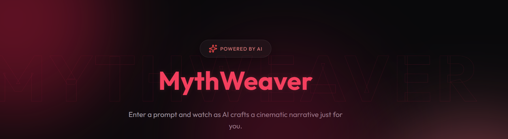
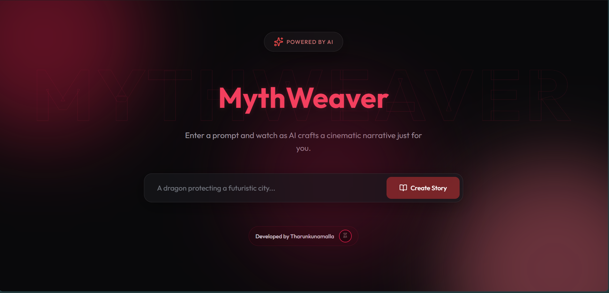
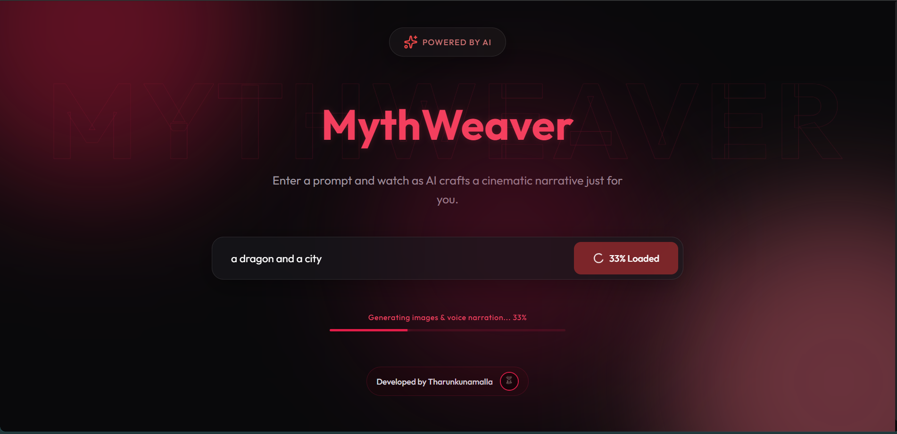
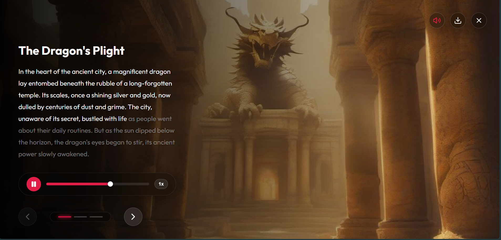
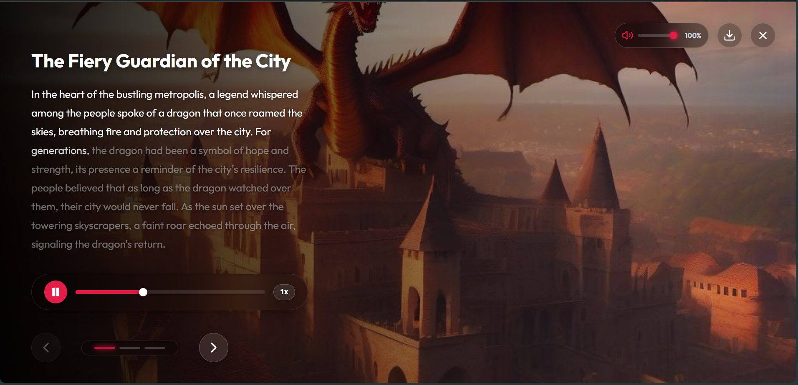
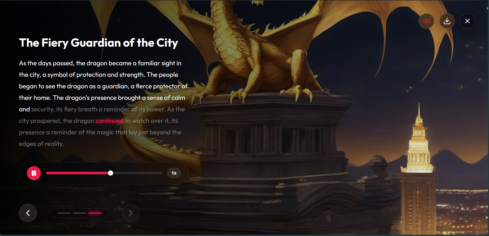
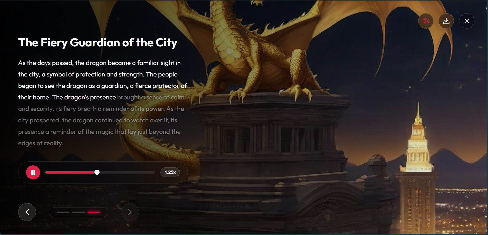
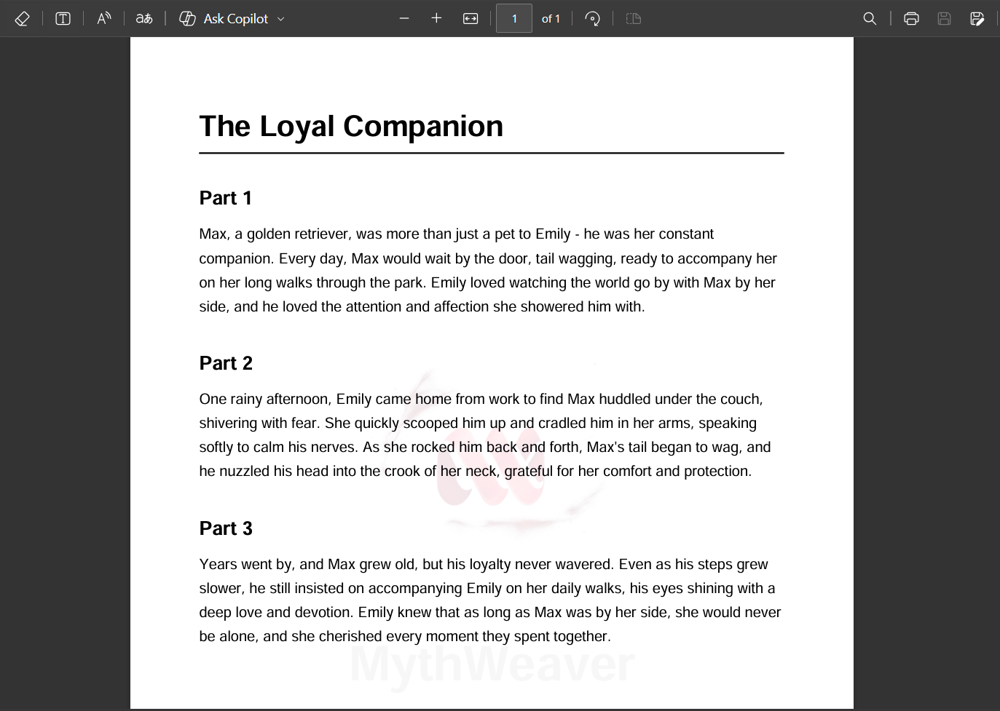
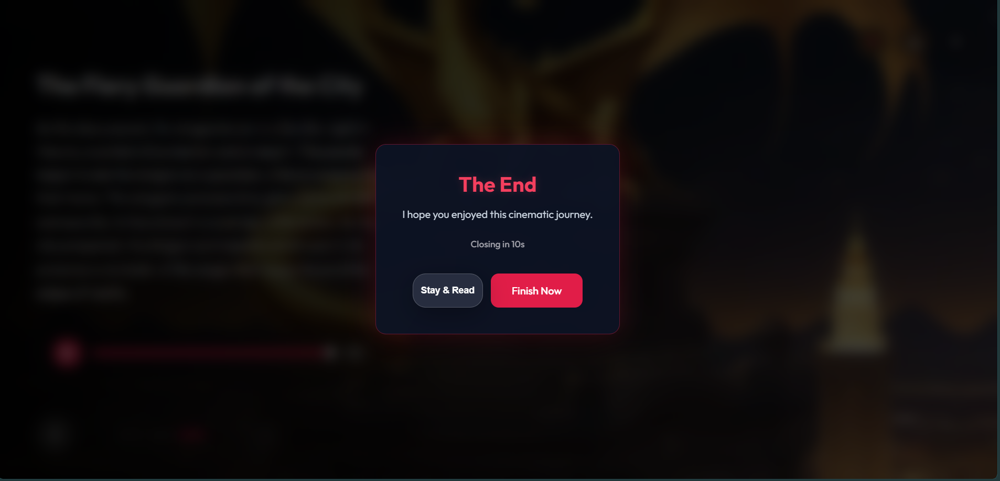

# MythWeaver: Cinematic AI Storytelling Platform


MythWeaver is a premium, full-stack AI storytelling application built with **React (Vite) + Framer Motion** on the frontend and **FastAPI (Python)** on the backend. It transforms simple user prompts into rich, multi-part audio-visual narratives complete with AI-generated background art, synchronized voice narration, dynamic background music, and exportable PDF manuscripts.

---

## Key Features

* **AI Story Generation**: Uses OpenAI / Groq LLMs to craft structured, multi-scene narratives with tailored visual and audio prompts.<br>
* **AI Image Generation (5-Tier Redundancy)**: Generates stunning 16:9 cinematic backdrops utilizing Hugging Face Stable Diffusion XL (`asyncio.to_thread`), multi-mirror Pollinations CDN rotation, Airforce AI proxy, Dicebear, and DummyImage fallbacks.<br>
* **Synchronized Voice Narration**: Features premium ElevenLabs TTS (Turbo model, Adam voice) with real-time word highlighting (`InteractiveAudioText`) and seamless fallback to Google TTS (`gTTS`).<br>
* **AI Background Music (Suno API & Curated CDNs)**: Generates dynamic AI background music via Suno API (`SUNO_API_KEY`) or serves curated, high-quality royalty-free cinematic BGM tracks matching the prompt's genre keywords (`cyberpunk`, `dark`, `peaceful`, `magic`, etc.).<br>
* **Right-Side Expanding Volume Pill**: A premium glassmorphism popover pill at the top right that expands smoothly on click to reveal a volume slider (`min="0" max="1" step="0.01"`) and percentage label, defaulting to a perfectly mixed `15%` background volume.<br>
* **Dynamic PDF Export (`jsPDF`)**: Client-side generated PDF manuscripts complete with custom canvas watermarking and smart pagination.<br>
* **Flawless Cinematic Animations**: Built with Framer Motion `AnimatePresence`. The top controls, bottom navigation bar, and scene images are fully unified in the DOM lifecycle, ensuring pixel-perfect transition synchronization across all story slides.

---

## 📸 Visual Showcase & Feature Walkthrough

### 1. Landing Page & Prompt Input

> **The Gateway to MythWeaver**: An elegant, glassmorphism-themed landing interface where users input their creative story concepts. Features a shimmering prompt textarea, glowing crimson accent buttons, and a curated dark-mode aesthetic designed for maximum immersion.

### 2. Parallel Preloading & Asset Generation

> **High-Performance Orchestration**: Showcases the multi-tiered preloading sequence. While the LLM structures the narrative scenes, the FastAPI backend simultaneously dispatches parallel worker threads to fetch 16:9 AI background art, ElevenLabs TTS voice audio, and Suno/CDN background music before the story begins.

### 3. Immersive Cinematic Story Viewer

> **The Core Storytelling Experience**: The primary audio-visual viewing interface. Seamlessly merges a stunning AI-generated background backdrop, bold typography title overlays, and a clean, distraction-free layout.

### 4. Expanding BGM Volume Popover Pill

> **Precision Audio Control**: Demonstrates the premium Framer Motion expanding popover pill at the top right. Clicking the speaker icon triggers a smooth spring animation revealing a horizontal range slider and percentage label, allowing users to dial in the perfect background music mix.

### 5. Interactive Word Highlighting & Seeking

> **Real-Time Audio-Visual Synergy**: Highlights the `InteractiveAudioText` component in action. Spoken words illuminate dynamically (`.spoken`) in perfect synchronization with the TTS audio track. Hovering over words reveals a glowing crimson text-shadow and enables instant click-to-seek narration jumping.

### 6. Custom Audio Player & Speed Controls

> **Granular Playback Management**: Displays the custom audio player bar featuring interactive playback speed adjustment (`1x`, `1.25x`, `1.5x`, `2x`), play/pause toggles, and a draggable progress bar kept safely above the bottom navigation controls.

### 7. Dynamic Watermarked PDF Export

> **Professional Manuscript Generation**: Illustrates the client-side generated PDF manuscript (`jsPDF`). Features custom HTML5 canvas watermarking (`opacity: 0.1`) imprinted with the official MythWeaver seal, elegant typography, and smart multi-page word wrapping.

### 8. Cinematic "The End" Finale Modal

> **A Dramatic Conclusion**: The final overlay screen that appears when a story concludes. Features a dramatic backdrop blur (`backdrop-filter: blur(10px)`), vibrant gradient typography, and an automated countdown timer before smoothly resetting the platform for a new story.

---

## tech Stack

* **Frontend**: React (Vite), Framer Motion (Choreography & Layout), Lucide React (Icons), Vanilla CSS (Glassmorphism & Rich Aesthetics).
* **Backend**: FastAPI (Python), Uvicorn, HTTPX (Async API Client), Pillow, gTTS.
* **AI APIs**: OpenAI / Groq (Text), Hugging Face / Pollinations (Images), ElevenLabs (Voice), Suno API (Music).

---

## 🚀 Getting Started

### 1. Server Setup (Backend)

1. Navigate to the `server` directory:
   ```bash
   cd server
   ```
2. Create a virtual environment and activate it:
   ```bash
   python -m venv venv
   # Windows
   .\venv\Scripts\activate
   # macOS/Linux
   source venv/bin/activate
   ```
3. Install dependencies:
   ```bash
   pip install -r requirements.txt
   ```
4. Set up your Environment Variables:
   Open `server/.env` and configure your API keys:
   ```env
   OPENAI_API_KEY=sk-your-openai-key
   HUGGINGFACE_API_KEY=hf_your_huggingface_token
   ELEVENLABS_API_KEY=xi-api-key-here
   SUNO_API_KEY=your_suno_api_key_optional
   ```
5. Run the server:
   ```bash
   uvicorn main:app --reload --port 8000
   ```
   *(Note: `main.py` includes automatic `sys.path` injection, allowing seamless execution even if run globally outside the venv).*

### 2. Client Setup (Frontend)

1. Open a new terminal and navigate to the `client` directory:
   ```bash
   cd client
   ```
2. Install dependencies:
   ```bash
   npm install
   ```
3. Run the development server:
   ```bash
   npm run dev
   ```
4. Open `http://localhost:5173` in your browser to experience MythWeaver!

---

## 🏛️ System Architecture

```
┌────────────────────────────────────────────────────────┐
│                 Client Browser (React)                 │
│                                                        │
│  ┌─────────────────┐ ┌───────────────┐ ┌────────────┐  │
│  │ Cinematic View  │ │  Audio Sync   │ │ jsPDF Gen  │  │
│  └────────┬────────┘ └───────┬───────┘ └────────────┘  │
└───────────┼──────────────────┼─────────────────────────┘
            │ POST /generate   │ GET /audio, /image, /music
            ▼                  ▼
┌────────────────────────────────────────────────────────┐
│                 FastAPI Backend Server                 │
│                                                        │
│  ┌─────────────────┐ ┌───────────────┐ ┌────────────┐  │
│  │   LLM Router    │ │ Image Engine  │ │ Audio/BGM  │  │
│  └────────┬────────┘ └───────┬───────┘ └─────┬──────┘  │
└───────────┼──────────────────┼───────────────┼─────────┘
            │                  │               │
            ▼                  ▼               ▼
     ┌─────────────┐    ┌─────────────┐ ┌──────────────┐
     │ OpenAI/Groq │    │ HuggingFace │ │ ElevenLabs / │
     │ LLM API     │    │ SDXL/Mirrors│ │ Suno / gTTS  │
     └─────────────┘    └─────────────┘ └──────────────┘
```
